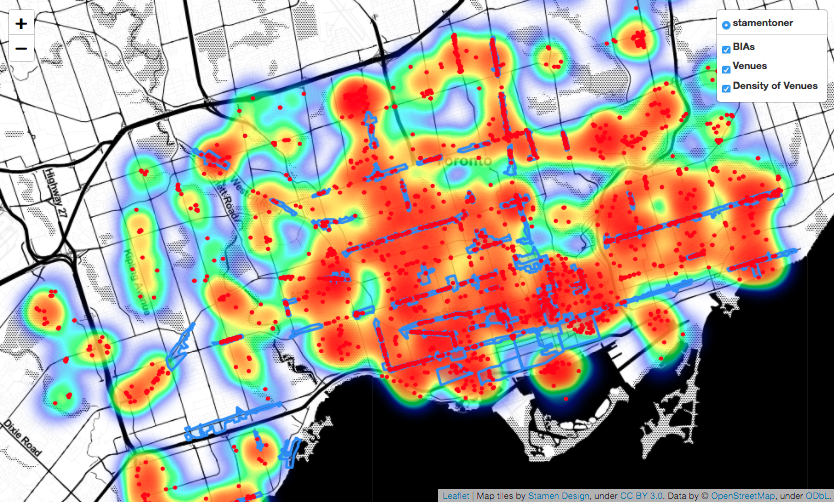
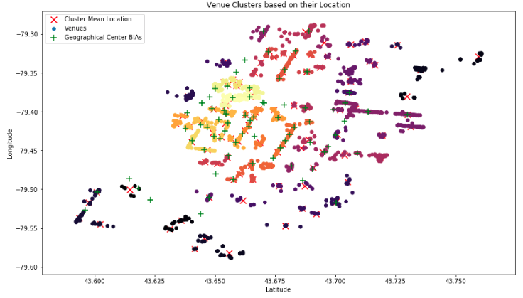
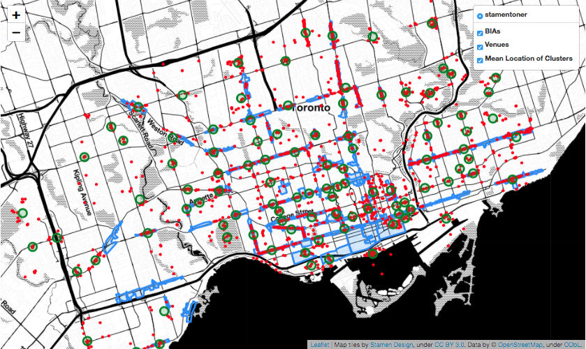
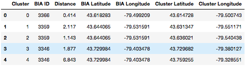
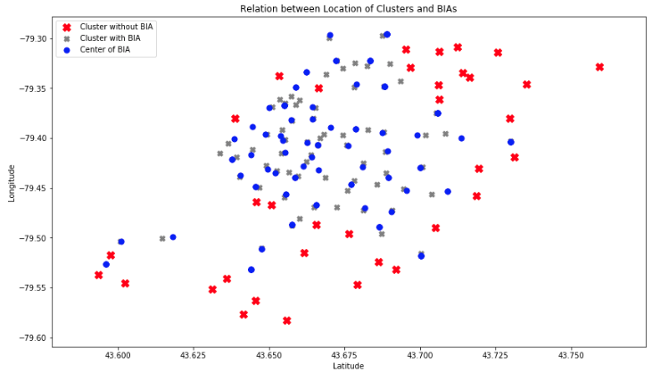
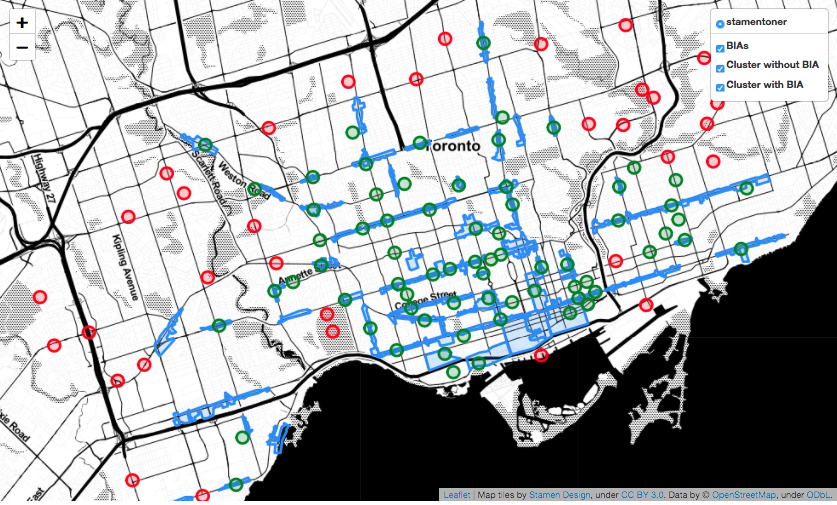

# Effectiveness of Business Improvement Areas (BIAs) in Toronto

The Report can also be found on [Medium](https://medium.com/@jpluebbert/effectiveness-of-business-improvement-areas-bia-in-toronto-3ce1dc6eb1ac).

## 1. Problem Description and Background Discussion
### 1.1 Problem Description
As part of the Capstone Project for the Applied Data Science Coursera Course, I have chosen to analyze the Business Improvement Area (BIA) Program of Toronto, ON in Canada. The question I will answer are: 
- **„Are most Venues in Central Toronto located near or in Business Improvement Areas?** 
- **A second question, but closely related to the first is: Are there clusters of Venues not located in BIAs that would be favourable locations for future BIAs?“** 

Both questions are of interest to city planners, politicians and venue owners or business people planing the location of future venues. City planners and politicians will be interested in areas that could be favourable locations for future BIAs. And businesspeople in the correlation between BIAs and the location of venues, since it enables better planning of future venue locations.

### 1.2 Background Discussion
The **Business Improvement Area (BIA)** is an association of commercial property owners and tenants within a defined area who work in partnership with the City to create thriving, competitive, and safe business areas that attract shoppers, diners, tourists, and new businesses. Each BIA has been defined by a by-law and is represented by a Board of Management. The question is how effective this association and the created Areas are for attracting business in the form of Venues. 

## 2. Data Description 
### 2.1 Description of Data and Data Source
To answer the question data from the following three sources is used:
- BIA Data: The BIA data represents the active BIAs in the City of Toronto that have so far been enacted by Council. The BIA layer is updated as BIAs are created, amended or deleted by the Council. The BIA data frame includes information about 83 BIAs and data about their id, name, location, area and polygon shape. From this BIA data frame, only the 74 BIAs located in the central area of Toronto are used. The BIAs Data can be found as GeoJSON file at [Toronto BIA Data](https://open.toronto.ca/dataset/business-improvement-areas/) and can be accessed via an API or downloaded as a file.
- Neighborhood Data: Data about the Boroughs and Neighborhoods in Toronto. The Neighborhood data frame includes information about 140 Neighborhoods in Toronto and there id, name, location, area and polygon shape. From these 140 Neighborhoods, only the 89 neighbourhoods located in the central area of Toronto are used. This data can be found as GeoJSON data at [Toronto Neighborhood Data](https://open.toronto.ca/dataset/neighbourhoods/).
- Venue Data: Data about the Venues located within Toronto is collected via the Foursquare API. This dataset contains venues located in Toronto, there id, location, name and venue category. Venue data will be collected for each of the 79 Neighborhoods. The collected venue data includes information about 2694 venues. 

### 2.2 How will the Data be used to solve the Problem
In the first step, the BIA and Neighborhood data will be reduced to include only BIAs and Neighborhoods located in the central area of Toronto. The resulting data will be plotted on a map of Toronto to show the areas of interest for this analysis, the location of the BIAs and the area, the Neighborhoods, for which data about Venues is collected. 

In a second step, the density of venues will be plotted as a heatmap onto the map of Toronto. This will show the location of areas with a high density of venues and therefore give a first overview of whether venues are mostly located near or in BIAs.

In a third step, the venues will be clustered depending on their location and their proximity to each other. This will be done using the HDBSCAN machine learning algorithm. The location of each cluster will be plotted onto a map to show his location in relation to the BIAs. This will answer the first question wether most Venues are located in or very near BIAs.

In a fourth step, the distance between the centre of each cluster and the centre of each BIA will be calculated. This will allow the matching of each cluster to his nearest BIA. Based on this distance clusters that are too far away from BIAs to be related to the BIA are designated as venue clusters that could locations for possible future BIAs. This will answer the question of whether there are venue clusters that would could be favourable locations for future BIAs.

## 3. Methodology used to analyse the data
The collected data is analysed in the following ways:
1. Mapping the Venues with a Heatmap to visualise the Venue Density
2. Clustering the Venues with HDBSCAN
3. Mapping the Clusters to visualise Venue Clusters
4. Identify Clusters without BIAs

### 3.1 Mapping the Venue Density
Using a Heatmap it is possible to show the Density of Venues for the Neighborhoods. As we can see most Venues are located in or very near BIAs. This is a first and only visual indication for the effectiveness of BIAs to promote the creation of Venues.

### 3.2 Clustering the Locations with HDBSCAN
**HDBSCAN** is an algorithm to find areas or clusters with a high density of data points. The algorithm makes few assumptions about the shape of the cluster, instead, it looks for areas with a higher density of data points than the surrounding areas. It is a non-parametric method that looks for a cluster hierarchy shaped by the multivariate modes of the underlying distribution [HDBSCAN Description](https://towardsdatascience.com/understanding-hdbscan-and-density-based-clustering-121dbee1320e). It excels therefor with data that has the following characteristics:
- Arbitrarily shaped clusters
- Clusters with different sizes and densities
- Noise
In this case, HDBSCAN is used to find clusters of Venues based on their Location. The parameters for tuning the algorithm allow setting the method for calculating the distance between the location points to **Haversine Distance**. Haversine Distance is a method for calculating the distance between Geographical Points (Latitude, Longitude). The second parameter set is the **min_cluster_size** and the third **epsilon** a measure for the max distance between the points. Min_cluster_size is set to min 5 Venues per cluster and epsilon to max 200 meters. 

### 3.3 Visualising and Mapping the Clusters
To visualise the clustered Venues their centre is calculated as the mean Latitude and Longitude for each cluster and then plotted onto the map of Toronto. As the map shows most clusters are located within the boundaries of the BIAs. The mapping also shows that some Venue clusters have not BIA nearby. This would be candidates for the future development of BIAs. 

### 3.4 Identifying Clusters without BIA
To identify Clusters that are not near an existing BIA and could, therefore, be place for future BIAs the distance between each cluster and its nearest BIA is the key. For that, the Haversine distance between each Cluster and each BIA is calculated and the BIA with the shortest distance for each Cluster is selected. The resulting data frame shows the distance for each pair of Cluster and BIA.

If the distance between Cluster and nearest BIA is greater than 800 m the cluster is identified as not directly belonging to the BIA. Based on this the data frame is split into clusters with a BIA nearby (800 m) and clusters without BIA nearby. Both are shown in the following scatterplot.

## 4. Results
The clusters and BIAs are mapped onto Toronto resulting in the following map. The map shows **35 Clusters without a BIA nearby**. This clusters would be prime locations for the future location of BIAs. Also, the map shows all 70 clusters of venues in central Toronto 70 that are located directly on or closer than 800 m apart from an existing BIA. This shows how effective BIAs are in promoting Business nearby.

## 5. Discussion
This report analyzes the effectiveness of BIAs in promoting business. This is measured in the proximity of venue clusters to BIAs. As the analysis shows 70 of 105 venue clusters are located directly on or in close proximity (less than 800 m) to the centre of BIAs. This clearly shows that BIAs are very effective in promoting the development of venues.
The analysis also shows that 35 venue clusters are located further (more than 800 m) away from BIAs. This clusters could be seeds for the location of further BIAs. 
For further analysis, the correlation between the time of BIA creation and the creation of venues in the BIAs should be researched. This would show whether BIAs are developed on the spot where venues exist or whether it is the BIAs existence that leads to the creation of venues. This would further show how effective BIAs are.

## 6. Conclusion
This report shows the effectiveness of BIAs and proves that they can play a key role in the development of business in a city. Also, the report shows possible locations for future BIAs. It could, therefore, be used to persuade city planners to create them and could also convince business owners or creators to locate their business in proximity to BIAs. 

## 7. References
- [1] Toronto Open Data (Business Improvement Areas)
- [2] Toronto Open Data (Neighborhoods)
- [3] Description of HDBSCAN
- [4] Wikipedia Haversine Distance